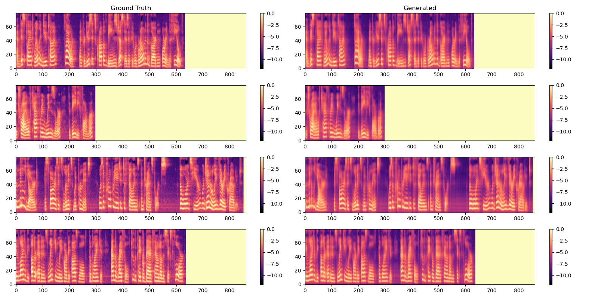
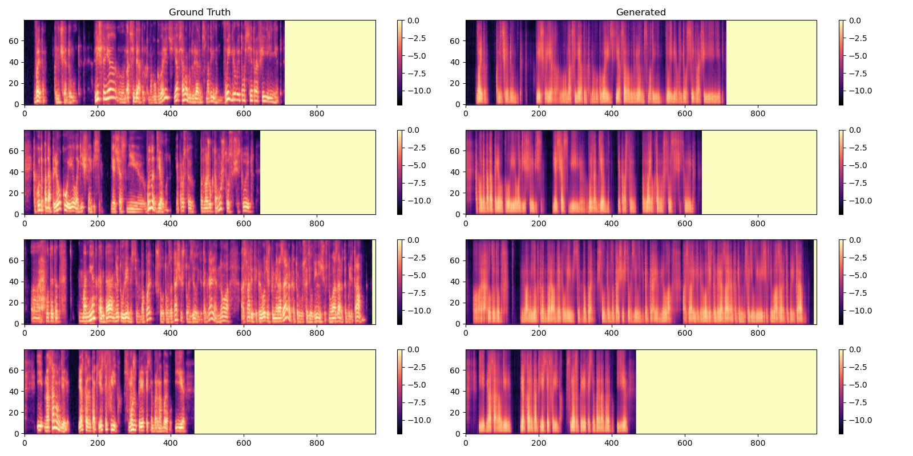

# Tacotron2 + HiFi-GAN: Text-to-Speech for Armenian

A PyTorch reimplementation of [Tacotron2](https://arxiv.org/pdf/1712.05884.pdf) and [HiFi-GAN](https://arxiv.org/pdf/2010.05646) from scratch for building a text-to-speech (TTS) system, with a focus on the underrepresented **Armenian language**. This project includes training pipelines, model architectures, and experimental results for both custom and benchmark datasets.

## ✨ Features

- **Tacotron2 Implementation**: Convert text to mel-spectrograms with a clean, customizable PyTorch implementation.
- **HiFi-GAN Integration** (🚧 Work in Progress): Vocoder to synthesize high-fidelity audio from mel-spectrograms.
- **Checkpoints & Results**: Intermediate checkpoints and visual comparisons provided.
- **Multilingual Support**: Tested on English (LJ Speech) and experimental support for Russian/Armenian.

## 📋 Table of Contents

- [Prerequisites](#-prerequisites)
- [Project Structure](#-project-structure)
- [Dataset Structure](#-dataset-structure)
- [Training](#-training)
- [Results](#-results)
- [Known Issues](#-known-issues)
- [Future Work](#-future-work)
- [Acknowledgements](#-acknowledgements)
- [Contribution](#-contribution)

## 🛠 Prerequisites

- Python 3.8+
- PyTorch 2.0+
- CUDA-capable GPU (recommended)
- Python Libraries:
  ```bash
  torchaudio >= 2.0.0
  numpy >= 1.23.0
  matplotlib >= 3.6.0
  librosa >= 0.10.0
  scipy >= 1.10.0
  tqdm >= 4.65.0
  pandas >= 1.5.0
  ```

## 📦 Project Structure

The project has the following structure:

```
📦 tts
├─ tacotron2
│  ├─ config.py
│  ├─ dataloader.py
│  ├─ decoder.py
│  ├─ encoder.py
│  ├─ loss.py
│  ├─ tacotron2.py
│  ├─ checkpoints/
│  │  └─ checkpoint_step_{step}.pth
│  └─ results/
│     ├─ loss/
│     │  └─ {Loss Plots}
│     └─ train/
│        └─ {Training Monitoring}
├─ hifigan
│  └─ 🚧 Work in progress
└─ data/
   ├─ wavs/
   └─ metadata.csv
```

## 📂 Dataset Structure

### Custom Dataset (Russian/Armenian)
This follows the same data structure as LJ Speech:
```
data/
├── wavs/                   # 16-bit WAV files (22.05 kHz)
│   ├── sample_001.wav
│   └── ...
└── metadata.csv            # Format: "sample_001","normalized_text"
```

- **Challenges**: 
  - The Russian dataset (~15h) uses audio from a sports blog, transcribed via OpenAI Whisper. Alignment issues arise due to missing filler words (e.g., "hmm"), laugh, cough, etc.
  - 🚧 A **manual Armenian dataset** is under development to meet Tacotron2’s strict alignment requirements.

### LJ Speech (English)
Standard [LJ Speech](https://keithito.com/LJ-Speech-Dataset/) structure for benchmarking.

---

Since there are no available datasets for the Armenian language, Russian was chosen to create a custom dataset because it works well for speech recognition. The dataset includes audio recordings from a Russian-speaking sports blog. Transcriptions were generated with OpenAI Whisper, but the text and audio alignment isn’t perfect, as Whisper doesn’t capture filler words like "hmm" or "emm." A custom Armenian dataset is currently being built manually to meet Tacotron2's quality requirements. Contributions to improve the Armenian dataset are welcome!

To help create the custom dataset, a utility tool (`data/convert.py`) was developed to transcribe audio files and prepare them for Tacotron2. The tool splits the input audio at pauses to create smaller chunks, each under 25MB and lasting 3 to 20 seconds. This tool could be useful for working with high-quality audio files in the future.

## 🎯 Training

### Tacotron2
```
tts/
├── wavs/                   # 16-bit WAV files (22.05 kHz)
│   ├── sample_001.wav
│   └── ...
└── metadata.csv            # Format: "sample_001","normalized_text"
```

Train the Tacotron2 model (run from the root folder):
```bash
python ./tacotron2/tacotron2.py
```

- During training, key metrics and outputs are regularly saved to the following directories:
  - **Loss plots**: Stored in `tacotron2/results/loss/`
  - **Model checkpoints**: Saved in `tacotron2/checkpoints/`
  - **Visualized training progress**: Includes mel-spectrograms and ground truths, located in `tacotron2/results/train/`

To customize how frequently these outputs are generated, you can adjust the relevant settings in the `tacotron2/config.py` file.

### HiFi-GAN (🚧 Work in Progress)
🚧

## 📊 Results

### LJ Speech (English) (~20h of speech)
- Achieved **visually aligned mel-spectrograms** after ~20k steps
- Audio quality improves significantly with longer training.



### Custom Dataset (Russian - Experimental) (~15h of speech)
- **Poor text-audio alignment**.
- Partial success in capturing global patterns, but the results remain poor after ~20k stpes.



This clearly demonstrates the importance of having a high-quality dataset with excellent alignment for training the Tacotron2 model.

## ⚠️ Known Issues

1. **Custom Dataset Quality**: Text-audio mismatches from Whisper-based alignment affect model performance as it doesn't *exactly* reflect the audio speech.
2. **HiFi-GAN Training**: Vocoder integration is incomplete; synthesized audio is currently unstable.

## 🔮 Future Work

- Build a higher-quality Armenian dataset with manual alignment.
- Complete HiFi-GAN integration for end-to-end TTS.

## 🙌 Acknowledgements

- [NVIDIA Tacotron2](https://github.com/NVIDIA/tacotron2): Base implementation reference.
- [HiFi-GAN](https://github.com/jik876/hifi-gan): Vocoder architecture.
- [OpenAI Whisper](https://github.com/openai/whisper): Used for custom dataset alignment (with limitations).
- The LJ Speech Dataset: For benchmarking and validation.
- ["La Saeta Rubia"](https://t.me/LSR_RM) Blog: For experimenting and building a dataset.

## 🤝 Contribution

Contributions are welcome! Please open an issue or PR for:
- Improving dataset quality for Armenian.
- Adding inference pipelines or multilingual support.